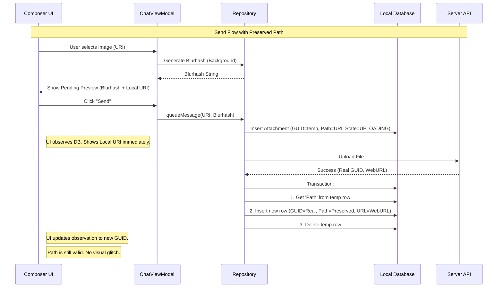

# UX Plan: Attachment Flow - Material Design 3 Revision

## Overview

This document outlines the revised technical and design approach for the attachment handling system in BothBubbles. It builds upon the identified issues in the original analysis but focuses on implementing **Material Design 3 (MD3)** principles to enhance usability, consistency, and visual appeal.

## Material Design 3 UI/UX Improvements

### 1. Attachment Picker & Input

**Current State**: Custom panels for Gallery, Files, GIFs.
**MD3 Recommendation**: **Modal Bottom Sheet**

- Replace custom panels with a unified `ModalBottomSheet`.
- **Drag Handle**: Include a visible drag handle at the top.
- **Grid Layout**: Use a staggered grid for media items (Gallery/GIFs) to handle varying aspect ratios gracefully.
- **Chips**: Use `FilterChip` or `SuggestionChip` at the top of the sheet to switch between "Gallery", "Files", "GIFs", and "Location".

**Technical Implementation**:

```kotlin
ModalBottomSheet(
    onDismissRequest = { showSheet = false },
    sheetState = sheetState,
    containerColor = MaterialTheme.colorScheme.surface,
    contentColor = MaterialTheme.colorScheme.onSurface,
    tonalElevation = 0.dp // MD3 prefers color over elevation
) {
    // Content
}
```

### 2. Camera Interface (Issue #1 Fix)

**Current State**: "Send" button is misleading; buttons lack hierarchy.
**MD3 Recommendation**: **Button Hierarchy**

- **Primary Action ("Attach")**: Use `FilledTonalButton` or `Button` (Filled). This indicates the affirmative action to use the photo.
- **Secondary Action ("Retake")**: Use `OutlinedButton` or `TextButton`.
- **Iconography**: Add an icon (e.g., `Icons.Rounded.Add` or `Icons.Rounded.Check`) to the "Attach" button.

**Revised Code Concept**:

```kotlin
Row(
    horizontalArrangement = Arrangement.SpaceBetween,
    modifier = Modifier.fillMaxWidth().padding(16.dp)
) {
    TextButton(onClick = onRetake) {
        Icon(Icons.Rounded.Refresh, contentDescription = null)
        Spacer(Modifier.width(8.dp))
        Text("Retake")
    }

    Button(onClick = onAttach) { // Changed from "Send" to "Attach"
        Icon(Icons.Rounded.Add, contentDescription = null)
        Spacer(Modifier.width(8.dp))
        Text("Attach")
    }
}
```

### 3. Attachment Previews & Loading (Issue #2, #3, #5)

**Current State**: Empty placeholders, broken images, infinite spinners.
**MD3 Recommendation**: **Visual State Feedback**

- **Loading**: Use `CircularProgressIndicator` inside a `Surface` with `surfaceVariant` color.
- **Placeholder**: If no blurhash is available, use a `Box` with `MaterialTheme.colorScheme.surfaceContainerHigh` and a centered, low-opacity icon (e.g., `Icons.Rounded.Image`).
- **Transitions**: Enable `crossfade` in Coil to smooth the transition from placeholder to image.
- **Shape**: Apply `MaterialTheme.shapes.medium` (typically 12dp-16dp) to all attachment previews.

**Coil Implementation with MD3**:

```kotlin
SubcomposeAsyncImage(
    model = ImageRequest.Builder(LocalContext.current)
        .data(imageUrl)
        .crossfade(true)
        .build(),
    loading = {
        Box(
            modifier = Modifier.background(MaterialTheme.colorScheme.surfaceContainerHigh),
            contentAlignment = Alignment.Center
        ) {
            CircularProgressIndicator(
                modifier = Modifier.size(24.dp),
                strokeWidth = 2.dp,
                color = MaterialTheme.colorScheme.primary
            )
        }
    },
    error = {
        Box(
            modifier = Modifier.background(MaterialTheme.colorScheme.errorContainer),
            contentAlignment = Alignment.Center
        ) {
            Icon(
                Icons.Rounded.BrokenImage,
                contentDescription = "Error",
                tint = MaterialTheme.colorScheme.onErrorContainer
            )
        }
    }
)
```

### 4. Error Handling (Issue #6)

**Current State**: Static error state, requires scroll to reset.
**MD3 Recommendation**: **Interactive Error States**

- **Tap-to-Retry**: The error container should be clickable.
- **Visuals**: Use `errorContainer` background color.
- **Overlay**: For large images, display a small `FilledTonalIconButton` with a refresh icon in the center.

### 5. Pending Attachments (Composer)

**Current State**: Small previews above the text field.
**MD3 Recommendation**: **Removable Input Chips or Cards**

- Use small `ElevatedCard` components for pending attachments.
- Include a small `IconButton` (close) in the top-right corner of the card.
- **Animation**: Animate the addition/removal of these items using `AnimatedVisibility`.

---

## Technical Architecture & Logic Refinements

### 1. The "Preserve Local Path" Strategy (Fixing Issue #2)

To support the seamless UI transitions required by MD3, the underlying data flow must ensure the image source never disappears.

**Revised `syncOutboundAttachments` Logic**:
Instead of deleting the temp attachment and creating a new one, we will **upsert** (update) the existing record.

1.  **Generate Temp GUID**: When user sends, create `AttachmentEntity` with `guid = "temp_${UUID}"` and `localPath = uri`.
2.  **Upload**: Upload file to server.
3.  **Server Response**: Receive real `guid` and `webUrl`.
4.  **Atomic Update**:
    - Update the _existing_ row's `guid` from temp to real (if DB supports cascading or manual update).
    - OR: Create new row with real GUID, copy `localPath` from temp row, then delete temp row.
    - **Crucial**: The `localPath` must be copied to the new entity.

### 2. Repository Pattern for Attachments

Introduce a unified `AttachmentRepository` that mediates between the local database and the remote API.

- **`observeAttachment(guid: String): Flow<AttachmentUiModel>`**
  - Emits updates whenever transfer state, progress, or local path changes.
  - UI simply collects this flow.

### 3. Blurhash & Placeholders (Issue #3)

Since the server doesn't provide blurhashes:

- **Client-Side Generation**: When selecting an image from Gallery, generate a Blurhash immediately on a background thread and store it in `PendingAttachmentInput`.
- **Persistence**: Save this generated blurhash to the `AttachmentEntity` immediately.
- **Benefit**: Immediate high-quality placeholder even before upload starts.

---

## Implementation Roadmap

### Phase 1: Foundation & Logic (High Priority)

1.  **Refactor `MessageSendingService`**: Implement "Preserve Local Path" logic.
2.  **Update `AttachmentEntity`**: Ensure `localPath` is nullable but preserved during sync.
3.  **Client-Side Blurhash**: Implement blurhash generation in `MediaPickerPanel`.

### Phase 2: MD3 Component Migration (Medium Priority)

1.  **Theme Update**: Ensure `MaterialTheme` (Compose M3) is fully set up with dynamic colors.
2.  **Camera Screen**: Rewrite buttons to use M3 `Button` and `TextButton`.
3.  **AttachmentContent**: Refactor to use `SubcomposeAsyncImage` with M3 error/loading slots.

### Phase 3: Advanced UX (Low Priority)

1.  **Unified Bottom Sheet**: Replace custom pickers with `ModalBottomSheet`.
2.  **Animated Transitions**: Add shared element transitions between chat and full-screen preview.

---

## Revised Flow Diagram (Data & UI)


