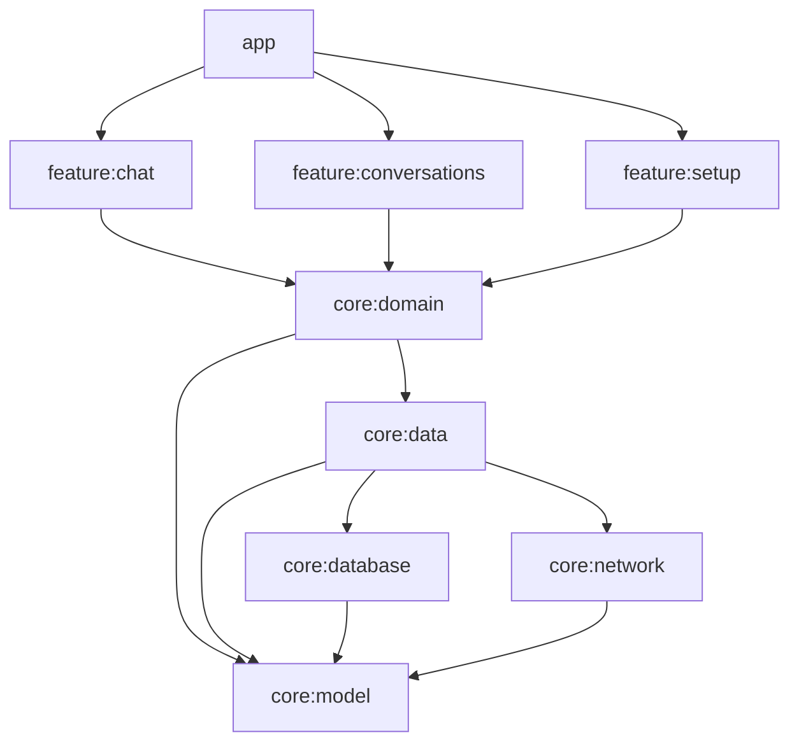

# Phase 6 Implementation: Modularization Strategy

## Proposed Module Graph



## Step 1: Extract `core:model`
Move `Message`, `Chat`, `Handle` data classes here.
This is the easiest step and breaks circular dependencies.

## Step 2: Extract `core:domain` (Interfaces)
Move `MessageSender` interface here.
Move `Repository` interfaces here.
**Do not** move implementations yet.

## Step 3: Extract `core:data` (Implementations)
Move `MessageSendingService`, `Room` DB, `Retrofit` clients here.

## Step 4: Feature Modules
Move `ChatViewModel` and Compose UI into `:feature:chat`.

## `settings.gradle.kts`
```kotlin
include(":app")
include(":core:model")
include(":core:domain")
include(":core:data")
include(":core:database")
include(":core:network")
include(":feature:chat")
```
